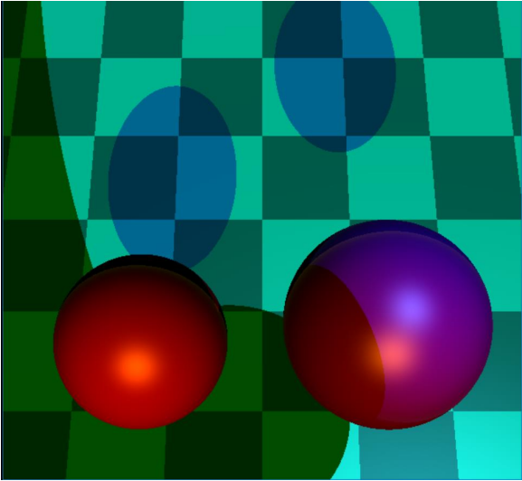
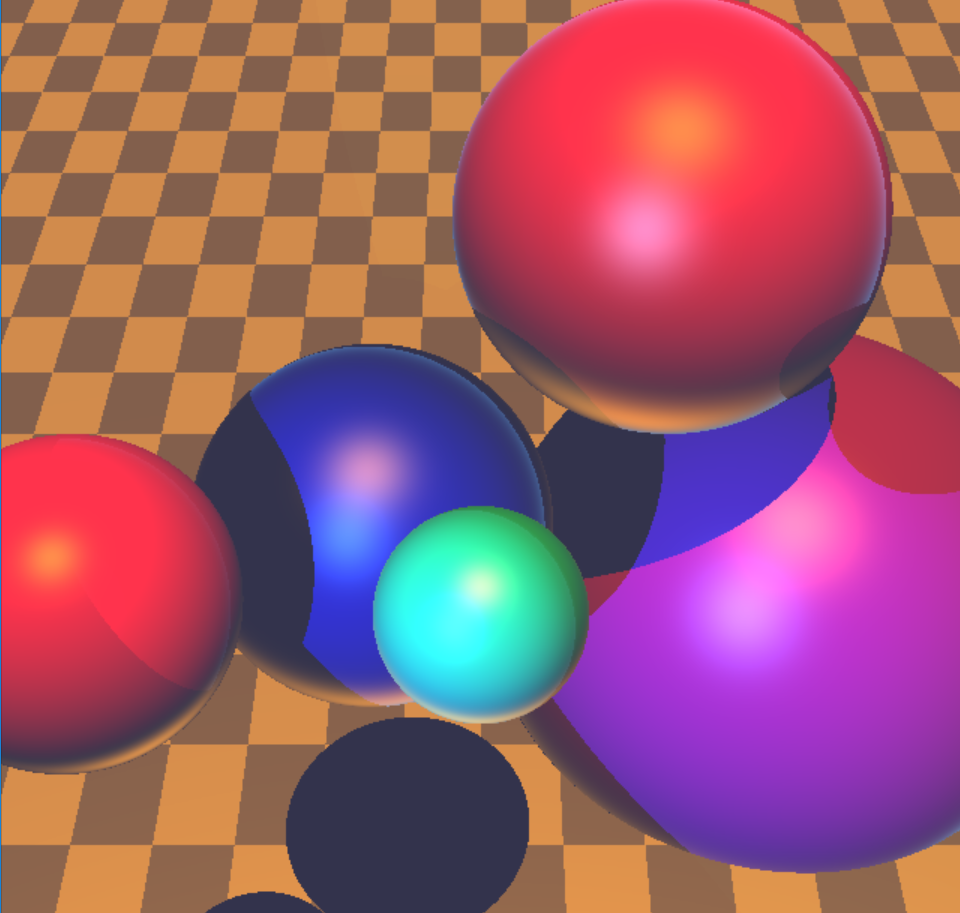
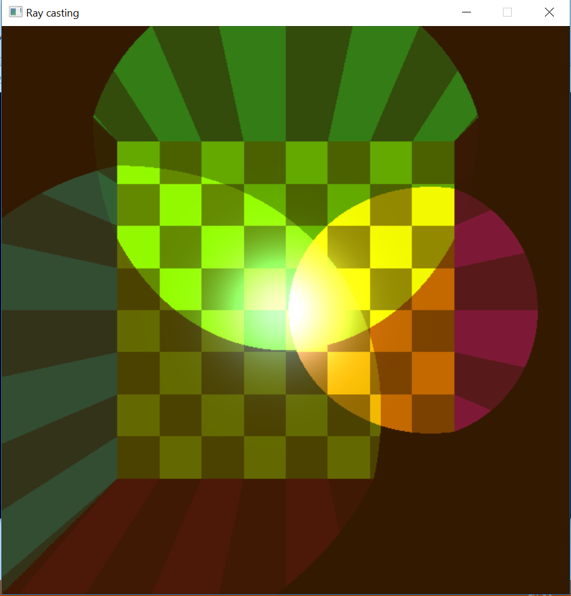

# RayTracer
Ray tracer with openGL - Implemetnation of  Phong lighting.

**Intro**

A ray tracer shoots
rays from the observer’s eye through a screen and into a scene of objects. It calculates the ray’s
intersection with objects, finds the nearest intersection and calculates the color of the surface
according to its material and lighting conditions.

**Lighting implementation contains:**

- ambient lighting – a color that reflects from all surfaces with equal intensity.

- Directional – A light source like the sun, which lies at infinity and has just a direction.

- Spot light – A point light source that illuminates in a direction given by a vector 𝐷. This light
source has a cutoff angle as describe in the following image.
Every light source has its own intensity (color) and there can be multiple light sources in a scene.
Shadows appear where objects obscure a light source. In the equation they are expressed in the 𝑆𝑖
term. 
To know if a point 𝑝 in space (usually on a surface) lies in a shadow of a light source,
you need to shoot a ray from 𝑝 in the direction of the light and check if it hits something. If it
does, make sure that it really hits it before reaching the light source and that the object hit is not
actually a close intersection with the object the ray emanated from. 

In addition, changing the forth coordinate of the eye (camera) vector will reveal a reflection ray tracing with  recursion level 1.

Different scenes can be found at rayTracr\res as text files.

## Project structure:

### engine
*This is the under-the-hood part that enables rendering meshes.*
- mesh.cpp
  - *Mesh represention via openGL.*
- shader.cpp
  - *Shader manager.*
- obj_lodaer.cpp
  - *.obj File parser.*

### rayTracer
*The actual rayTracer implementation.*
- main.cpp
  - *Entry point.*
- rayTracerShader.glsl
  - *Fragement shader.*

## Future Possible Upgrades
- Refraction
- Reflection with levels of recursion.

##  Images:

